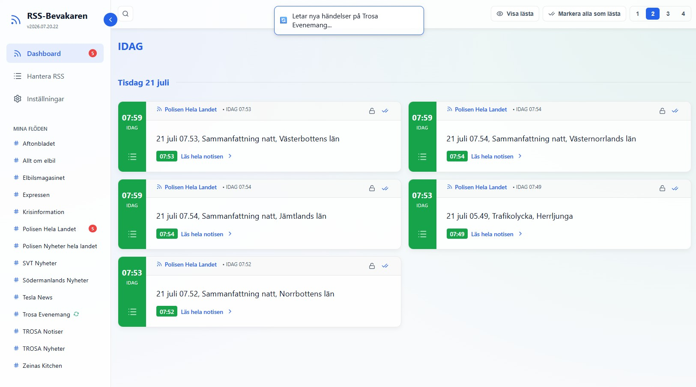

# RSS-Bevakaren



Ett modernt system för att övervaka och presentera RSS-flöden i realtid. Byggt med en stilren design (inspirerad av PolisInfo), robust Python-backend och en responsiv React-frontend.

## Funktioner
- **Multi-användare:** Säker inloggning via JWT-autentisering. Varje användare har sina egna flöden och inställningar.
- **RSS-Hantering:** Lägg till och ta bort RSS-flöden som ska övervakas med inbyggd sökfunktion och automatisk sortering.
- **Dashboard:** Presenterar de senaste nyheterna från dina valda flöden i ett samlat gränssnitt.
- **Artikelhantering:** Lås fast viktiga nyheter (skydda dem från att raderas) eller markera dem som lästa/olästa.
- **Nyckelordsbevakning:** Möjlighet att lägga in larmord. Larmordsnotiser är helt oberoende och skickas ut oavsett flödets inställningar för allmänna notiser.
- **PWA & WebPush:** Fullt fungerande Progressiv Webbapp (PWA) med stöd för blixtsnabba push-notiser i både dator och mobil, oavsett om appen är öppen eller inte.
- **Databashantering:** Möjlighet att rensa bort gammal data (purge) från inställningarna. Du bestämmer själv hur många dagar data ska sparas.
- **Mångsidig kompatibilitet:** Accepterar i princip alla RSS-format, inklusive WordPress-flöden, Atom och standard RSS 2.0.

## Arkitektur
Systemet bygger på en Docker-baserad mikrotjänstarkitektur:
- **Backend:** Python med FastAPI, SQLAlchemy och SQLite.
- **Frontend:** React (byggt med Vite), React Router och Axios.
- **Infrastruktur:** Byggd för publicering via GitHub Container Registry (GHCR) med en produktionsklar `docker-compose.yml`.

## Utveckling (Lokal körning)
1. Klona repositoryt.
2. För backend:
   ```bash
   cd backend
   pip install -r requirements.txt
   uvicorn main:app --reload
   ```
   *Standard inloggning skapas automatiskt: `admin` / `admin`*
3. För frontend:
   ```bash
   cd frontend
   npm install
   npm run dev
   ```

## Produktionskörning
Applikationen driftsätts enklast via Docker. Nedan finns en färdig `docker-compose.yml` som du kan kopiera rakt av. Den laddar ner de färdigbyggda image-filerna (inga bygg-steg krävs lokalt) och sätter upp databasen.

Skapa en fil med namnet `docker-compose.yml` på din server:

```yaml
services:
  backend:
    image: ghcr.io/minglarn/rss_bevakaren_backend:latest
    ports:
      - "8094:8000"
    volumes:
      # Lagra databasen i en dedikerad data-mapp på hosten så den överlever omstarter
      - ./data:/data
    environment:
      - DATABASE_URL=sqlite:////data/rss.db
      # Multi-user setup: Separera med kommatecken. Ordningen matchar.
      - APP_USERNAME=admin
      - APP_PASSWORD=admin_password
    restart: unless-stopped

  frontend:
    image: ghcr.io/minglarn/rss_bevakaren_frontend:latest
    ports:
      - "8093:80"
    environment:
      - TZ=Europe/Stockholm
      # Ändra detta till din IP eller domän om du kör från en annan dator:
      - VITE_API_URL=http://localhost:8094
    restart: unless-stopped
    depends_on:
      - backend
```

Starta sedan upp allting med:
```bash
docker-compose up -d
```

## Versionshantering
Projektet använder CalVer (ex. 2026.07.21.01).
