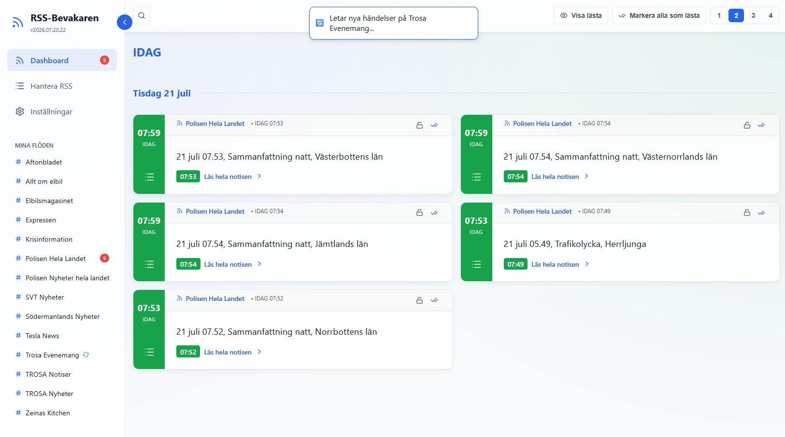

# RSS-Bevakaren




A modern system for monitoring and presenting RSS feeds in real-time. Built with a clean design, a robust Python backend, and a responsive React frontend.

## Features
- **Multi-user:** Secure login via JWT authentication. Each user has their own feeds and settings.
- **RSS Management:** Add and remove monitored RSS feeds with built-in search and automatic sorting.
- **Dashboard:** Presents the latest news from your selected feeds in a unified interface.
- **Article Management:** Lock important news (protecting them from deletion) or mark them as read/unread.
- **Keyword Monitoring:** Add alert keywords. Keyword notifications are independent and sent regardless of the feed's general notification settings.
- **PWA & WebPush:** Fully functional Progressive Web App (PWA) with support for lightning-fast push notifications on both desktop and mobile, even when the app is closed.
- **Database Management:** Purge old data from the settings. You decide how many days of data to keep.
- **Versatile Compatibility:** Accepts virtually all RSS formats, including WordPress feeds, Atom, and standard RSS 2.0.

## Architecture
The system is built on a Docker-based microservices architecture:
- **Backend:** Python with FastAPI, SQLAlchemy, and SQLite.
- **Frontend:** React (built with Vite), React Router, and Axios.
- **Infrastructure:** Built for publishing via GitHub Container Registry (GHCR) with a production-ready `docker-compose.yml`.

## Production Deployment
The easiest way to deploy the application is via Docker. Below is a ready-to-use `docker-compose.yml`. It pulls the pre-built images (no local building required) and sets up the database.

Create a file named `docker-compose.yml` on your server:

```yaml
services:
  backend:
    image: ghcr.io/minglarn/rss_bevakaren_backend:latest
    ports:
      - "8094:8000"
    volumes:
      # Store the database in a dedicated data folder on the host so it survives restarts
      - ./data:/data
    environment:
      - DATABASE_URL=sqlite:////data/rss.db
      # Multi-user setup: Separate with commas. Order matches.
      - APP_USERNAME=admin
      - APP_PASSWORD=admin_password
    restart: unless-stopped

  frontend:
    image: ghcr.io/minglarn/rss_bevakaren_frontend:latest
    ports:
      - "8093:80"
    environment:
      - TZ=Europe/Stockholm
      # Change this to your IP or domain if accessing from another machine:
      - VITE_API_URL=http://localhost:8094
    restart: unless-stopped
    depends_on:
      - backend
```

Then start everything up with:
```bash
docker-compose up -d
```

## Versioning
The project uses CalVer (e.g. 2026.07.26.01).
