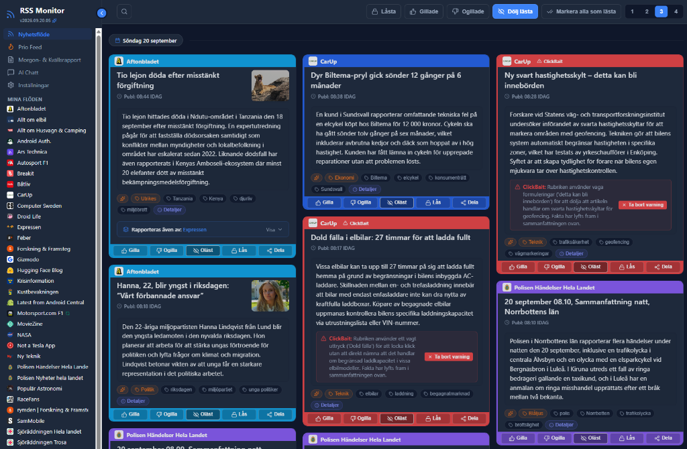
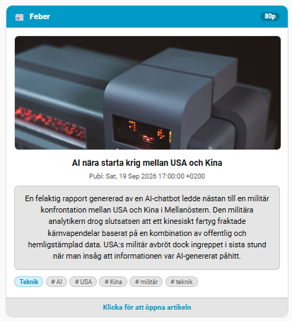

# RSS-Bevakaren




RSS-Bevakaren är en modern, självhostad nyhetsaggregator för RSS-, Atom- och WordPress-flöden med stöd för lokal AI via LM Studio, Ollama eller valfri OpenAI-kompatibel motor. Systemet filtrerar bort brus, sammanfattar artiklar, avslöjar ClickBait, prioriterar viktiga nyheter och integreras sömlöst med Home Assistant via MQTT Auto-Discovery.

---

## Snabbstart med Docker Compose

Skapa en `docker-compose.yml` på din server:

```yaml
services:
  backend:
    image: ghcr.io/minglarn/rss_bevakaren_backend:latest
    ports:
      - "8094:8000"
    volumes:
      - ./data:/data
    environment:
      - TZ=Europe/Stockholm
      - DATABASE_URL=sqlite:////data/rss.db
      # Fleranvändarstöd: Separera användarnamn och lösenord med kommatecken för flera konton
      - APP_USERNAME=admin,anvandare2
      - APP_PASSWORD=ditt_sakna_losenord,andra_losenordet
      
      # Lokal AI via LM Studio, Ollama eller valfritt OpenAI-kompatibelt API (valfritt)
      - LM_STUDIO_URL=http://192.168.1.50:1234/v1/chat/completions
      - LM_STUDIO_TIMEOUT=120
      - AI_MAX_ARTICLE_AGE_HOURS=24
      
      # Home Assistant & MQTT (valfritt, avstängt som standard)
      - MQTT_ENABLED=false
      - MQTT_BROKER=192.168.1.50
      - MQTT_PORT=1883
      - MQTT_USERNAME=                # Lämna tomt om brokern tillåter anonym anslutning
      - MQTT_PASSWORD=                # Lämna tomt om brokern tillåter anonym anslutning
      - MQTT_TOPIC_PREFIX=rss_bevakaren
      - MQTT_DISCOVERY_ENABLED=true   # Aktiverar Home Assistant MQTT Auto-Discovery
    restart: unless-stopped

  frontend:
    image: ghcr.io/minglarn/rss_bevakaren_frontend:latest
    ports:
      - "8093:80"
    environment:
      - TZ=Europe/Stockholm
      - VITE_API_URL=http://din-server-ip:8094
    restart: unless-stopped
    depends_on:
      - backend
```

Starta tjänsten:
```bash
docker compose pull
docker compose up -d
```

Öppna `http://din-server-ip:8093` i webbläsaren för att logga in.

---

## Huvudfunktioner

- **Lokal AI-sammanfattning:** Sammanfattar inkommande artiklar i realtid genom anslutning till din lokala AI-motor (t.ex. Google Gemma via LM Studio eller Ollama) – helt privat utan dataläckage till externa molntjänster.
- **ClickBait-avslöjare:** Sensationella eller undanhållande rubriker flaggas automatiskt och AI-sammanfattningen lyfter direkt fram vad artikeln faktiskt handlar om.
- **Intelligent Prio-flöde:** Händelser poängsätts (0–100p) baserat på nyhetsvärde, akuthet, faktasubstans och dina egna intresseområden.
- **Adaptiv intresseprofil (Gilla / Ogilla):** Genom att klicka tumme upp eller ner på artiklar tränas din personliga profil för att automatiskt lyfta respektive dämpa liknande ämnen.
- **Ämnesklustring:** Artiklar från flera olika redaktioner som rapporterar om samma händelse buntas automatiskt ihop till ett gemensamt kluster.
- **Dagens Briefing:** Automatisk morgon- och kvällsrapport (kl 07:00 och 18:00) som sammanfattar nyhetsläget med text och inbyggd talsyntes.
- **Interaktiv AI-chatt (RAG):** Ställ frågor på naturligt språk till ditt samlade nyhetsarkiv med källhänvisningar och direktlänkar.
- **Inbyggd svensk RSS-katalog:** Över 300 förkonfigurerade svenska nyhetskällor, lokaltidningar, myndighetsflöden och branschtidskrifter redo för ett-klicks-prenumeration.
- **Bred flödeskompatibilitet (RSS, Atom & WordPress):** Fullt stöd för standard RSS 2.0, Atom samt alla WordPress-baserade webbplatser (ange webbplatsens URL eller `/feed`). Parsern extraherar automatiskt omslagsbilder, mediainnehåll och redaktionella taggar.
- **PWA & Web Push:** Installera som app på mobil eller dator med stöd för direkta pushnotiser vid viktiga larm.
- **Fleranvändarstöd:** Flera användare kan dela samma instans med fullständig isolering av flöden, filter och notiser.

---

## Home Assistant Integration

RSS-Bevakaren har fullt stöd för **MQTT Auto-Discovery**. När `MQTT_ENABLED=true` är aktiverat skapas och uppdateras alla sensorer automatiskt i Home Assistant utan behov av manuell YAML-konfiguration.

### Fleranvändarstöd i Home Assistant
Om systemet har flera användare (konfigureras via `APP_USERNAME` och `APP_PASSWORD` separerat med kommatecken) grupperar Home Assistant automatiskt sensorerna under separata enheter per användarkonto. Exempel med `admin` och `anvandare2`:
- **Enhet: RSS-Bevakaren (admin):** med sensor `sensor.rss_admin_prio` samt kontots alla flödessensorer.
- **Enhet: RSS-Bevakaren (anvandare2):** med sensor `sensor.rss_anvandare2_prio` samt kontots alla flödessensorer.

> **Obs:** Ovanstående är ett exempel. Sensorernas ID anpassas automatiskt efter de faktiska användarnamn som anges i `APP_USERNAME` (t.ex. `sensor.rss_<användarnamn>_prio`).

### Färdigt Dashboard-kort (custom:button-card)
Detta kort anpassar sig automatiskt efter Home Assistants tema (mörkt/ljust) och visar källans logotyp, rubrik, artikelbild, AI-sammanfattning, poäng och taggar. Klick på kortet öppnar artikeln direkt hos källan.

<p align="center">
  
</p>

<details>
<summary><b>Klicka för att visa YAML-koden för custom:button-card</b></summary>

```yaml
type: custom:button-card
entity: sensor.rss_admin_prio
show_name: false
show_icon: false
show_state: false
tap_action:
  action: url
  url_path: "[[[ return (entity && entity.attributes && entity.attributes.link) ? entity.attributes.link : '#'; ]]]"
styles:
  card:
    - background: "var(--ha-card-background, var(--card-background-color, var(--primary-background-color)))"
    - border: "1px solid var(--ha-card-border-color, var(--divider-color, rgba(127, 127, 127, 0.2)))"
    - border-radius: "var(--ha-card-border-radius, 12px)"
    - box-shadow: "var(--ha-card-box-shadow, none)"
    - padding: "0px"
    - overflow: "hidden"
    - color: "var(--primary-text-color)"
    - text-align: "left"
    - cursor: "pointer"
  grid:
    - grid-template-areas: '"main"'
    - grid-template-columns: "1fr"
    - grid-template-rows: "1fr"
custom_fields:
  main: >
    [[[
      if (!entity || !entity.attributes) {
        return '<div style="padding: 16px; color: var(--secondary-text-color);">Väntar på händelse eller så är entiteten inte tillgänglig...</div>';
      }
      const a = entity.attributes;
      if (!a.title) return '<div style="padding: 16px; color: var(--secondary-text-color);">Ingen händelse mottagen än.</div>';
      
      let tagsHtml = '';
      if (a.tags && Array.isArray(a.tags)) {
        tagsHtml = a.tags.map(t => `<span style="background: var(--secondary-background-color, rgba(127, 127, 127, 0.1)); color: var(--secondary-text-color); border: 1px solid var(--divider-color, rgba(127, 127, 127, 0.2)); font-size: 11px; padding: 2px 8px; border-radius: 10px; margin-right: 4px; margin-bottom: 4px; display: inline-block; white-space: nowrap;"># ${t}</span>`).join('');
      }

      const iconHtml = a.feed_icon 
        ? `` 
        : `<span>RSS</span>`;

      const mainImageHtml = (a.image_url && a.image_url.trim() !== "")
        ? `<div style="width: 100%; max-height: 200px; overflow: hidden; border-radius: 8px; margin-bottom: 12px; border: 1px solid var(--divider-color, rgba(127, 127, 127, 0.15));">
             
           </div>`
        : '';

      return `
        <div>
          <!-- Header -->
          <div style="background-color: var(--primary-color, #03a9f4); padding: 10px 14px; display: flex; align-items: center; justify-content: space-between; font-weight: 700; font-size: 14px; color: var(--text-primary-color, #ffffff);">
            <div style="display: flex; align-items: center; gap: 8px;">
              ${iconHtml}
              <span>${a.source || 'RSS'}</span>
            </div>
            ${a.prio_score ? `<span style="background: rgba(0,0,0,0.2); color: inherit; padding: 2px 8px; border-radius: 10px; font-size: 11px; font-weight: 600;">${a.prio_score}p</span>` : ''}
          </div>

          <!-- Innehåll -->
          <div style="padding: 14px;">
            ${mainImageHtml}

            <div style="font-size: 15px; font-weight: 700; line-height: 1.4; margin-bottom: 6px; color: var(--primary-text-color); white-space: normal;">
              ${a.title}
            </div>
            
            <div style="font-size: 12px; color: var(--secondary-text-color); margin-bottom: 10px; white-space: normal;">
              Publ: ${a.published || ''}
            </div>

            <div style="background: var(--secondary-background-color, rgba(127, 127, 127, 0.08)); padding: 12px; border-radius: 8px; font-size: 13.5px; line-height: 1.5; color: var(--primary-text-color); border: 1px solid var(--divider-color, rgba(127, 127, 127, 0.15)); margin-bottom: 12px; white-space: normal; word-break: break-word;">
              ${a.summary || ''}
            </div>

            <!-- Taggar & Kategori -->
            <div style="display: flex; flex-wrap: wrap; align-items: center; white-space: normal;">
              <span style="background: rgba(var(--rgb-primary-color, 3, 169, 244), 0.15); color: var(--primary-color, #03a9f4); border: 1px solid rgba(var(--rgb-primary-color, 3, 169, 244), 0.3); font-size: 11px; padding: 2px 8px; border-radius: 10px; margin-right: 4px; margin-bottom: 4px; font-weight: 600; display: inline-block; white-space: nowrap;">
                ${a.category || ''}
              </span>
              ${tagsHtml}
            </div>
          </div>

          <!-- Footer -->
          <div style="background: var(--secondary-background-color, rgba(127, 127, 127, 0.08)); border-top: 1px solid var(--divider-color, rgba(127, 127, 0.15)); padding: 8px; text-align: center; font-size: 12.5px; font-weight: 600; color: var(--primary-color, #03a9f4); white-space: normal;">
            Klicka för att öppna artikeln
          </div>
        </div>
      `;
    ]]]
```
</details>

---

## Avancerade detaljer

<details>
<summary><b>Klicka för att läsa: Hur fungerar AI-prioriteringen? (0–100 poäng)</b></summary>

### Poängberäkning
Varje artikel bedöms utifrån tre grundfaktorer:
1. **Ditt kategori-intresse (30 %):** Baserat på dina egna viktreglage (0–10) i inställningarna.
2. **Akuthet & Nyhetsvärde (40 %):** AI-bedömning av händelsens allvar och brytpunkt.
3. **Faktasubstans & Djup (30 %):** Skiljer korta rykten från genomarbetad journalistik.

### Bonusar & Justeringar
- **PRIO-tröskel:** Artiklar som når minst 75 poäng märks med orange PRIO-etikett och skickas till prio-strömmen.
- **Bevakningsord:** Exakta träffar på dina sökord ger direkt 100 poäng och omedelbar avisering.
- **Gilla / Ogilla:** Gillade ämnen ger +10p bonus vid framtida matchningar. Ogillade ämnen får -15p avdrag.
- **Flerkällsbekräftelse:** Om 2 källor rapporterar om samma sak ges +10p. 3 eller fler ger +15p.
- **ClickBait-avdrag:** Sensationella rubriker får ett automatiskt avdrag på 25 poäng.

### Rekommenderade modeller
- **LLM:** `google/gemma-4-12b-qat` (snabb inferens och stark svensk språkförståelse).
- **Embeddings:** `text-embedding-nomic-embed-text-v1.5` (768 dimensioner för hybrid-RAG).
</details>

<details>
<summary><b>Klicka för att läsa: Teknisk MQTT JSON-specifikation</b></summary>

Varje publicerat MQTT-meddelande innehåller en komplett JSON-nyttolast:

```json
{
  "id": 1420,
  "user": "admin",
  "user_id": 1,
  "title": "Chocksiffrorna: Nu höjs bilskatten med 1300%",
  "source": "CarUp",
  "feed_slug": "carup",
  "feed_id": 4,
  "feed_icon": "https://www.google.com/s2/favicons?domain=carup.se&sz=128",
  "feed_domain": "carup.se",
  "summary": "Nya EU-siffror visar att laddhybrider släpper ut mer koldioxid än tidigare uppgett.",
  "short_summary": "Nya EU-siffror medför kraftigt höjd fordonsskatt för laddhybrider.",
  "raw_summary": "Ursprunglig ingress...",
  "link": "https://carup.se/...",
  "image_url": "https://carup.se/.../bild.jpg",
  "published": "Tue, 09 Sep 2026 17:15:00 +0200",
  "published_ts": 1788983700,
  "received_ts": 1788983750,
  "is_prio": true,
  "prio_score": 85,
  "prio_reason": "Träff på bevakningsord: bilskatt",
  "matched_keywords": ["bilskatt"],
  "is_clickbait": true,
  "clickbait_reason": "Rubriken döljer vad skattehöjningen gäller.",
  "category": "Ekonomi",
  "tags": ["bilskatt", "laddhybrider", "utsläpp"]
}
```

### Ämneshierarki
- `{prefix}/status`: Global anslutningsstatus (`online` / `offline`).
- `{prefix}/{användare}/feeds/{feed_slug}`: Flödesspecifik ström.
- `{prefix}/{användare}/prio`: Högprioriterade händelser för respektive användare.
</details>

<details>
<summary><b>Klicka för att läsa: Arkitektur & Mikrotjänster</b></summary>

- **Backend:** Python med FastAPI, SQLAlchemy, SQLite, paho-mqtt, Schemalagda bakgrundstrådar.
- **Frontend:** Single Page Application (SPA) byggd med React, Vite, Framer Motion, Tailwind/Vanilla CSS och Lucide-ikoner.
- **Drift:** Docker-containrar via GitHub Container Registry (GHCR).
</details>

---

## Versionshantering

Projektet tillämpar strikt kalenderbaserad versionshantering (CalVer), exempelvis `2026.09.20.14`. Versionsnumret uppdateras inför varje leverans för att garantera full spårbarhet mellan källkod, container-taggar och ändringslogg.
